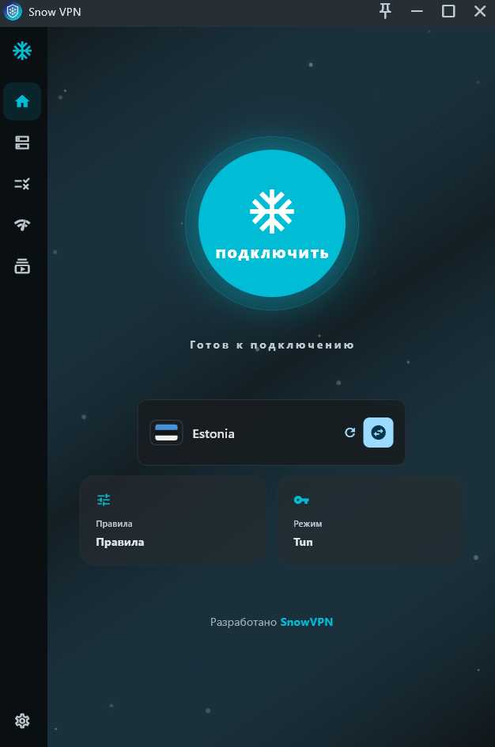
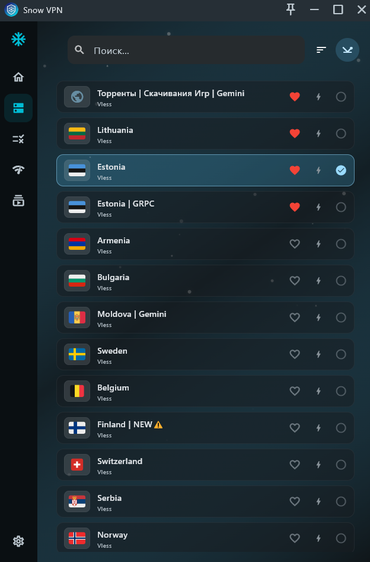
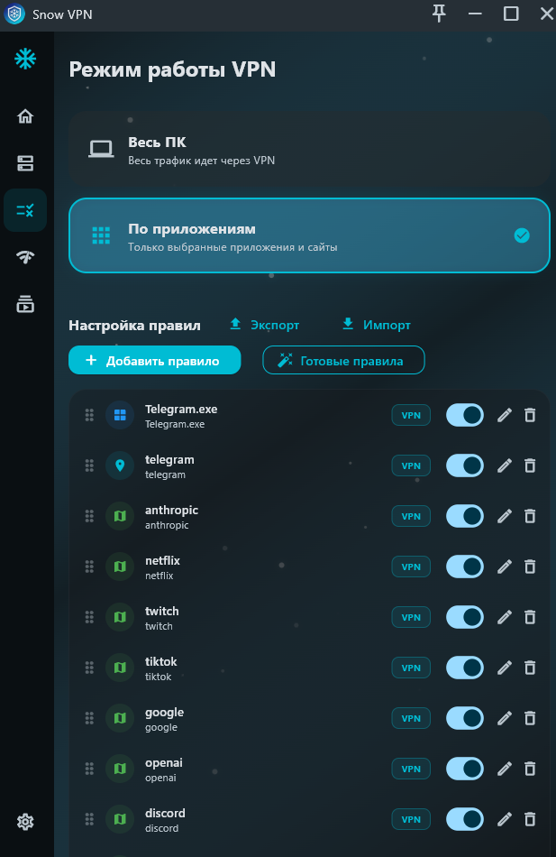
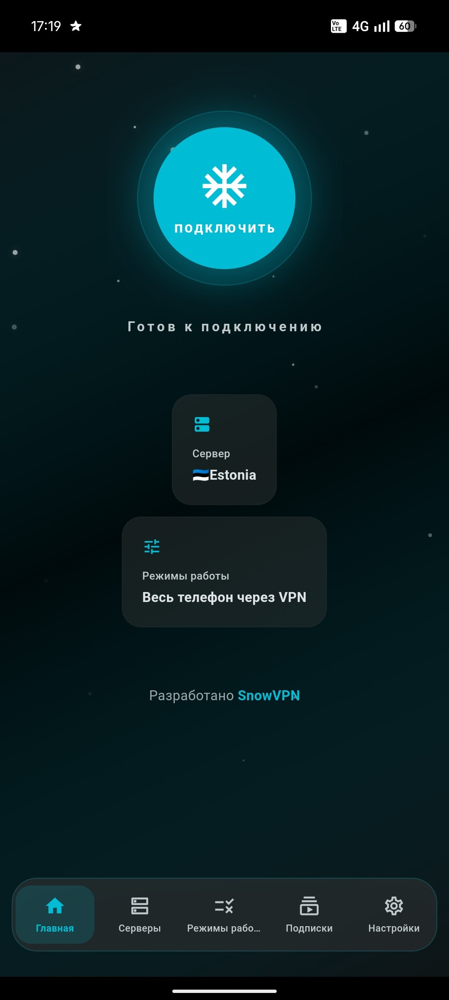
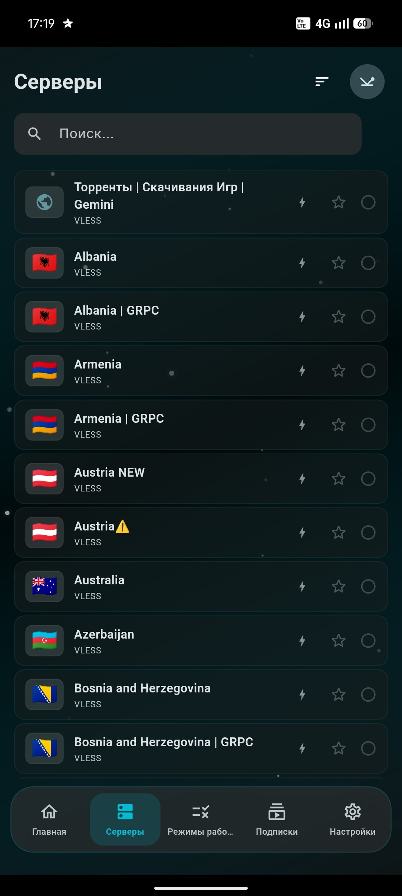
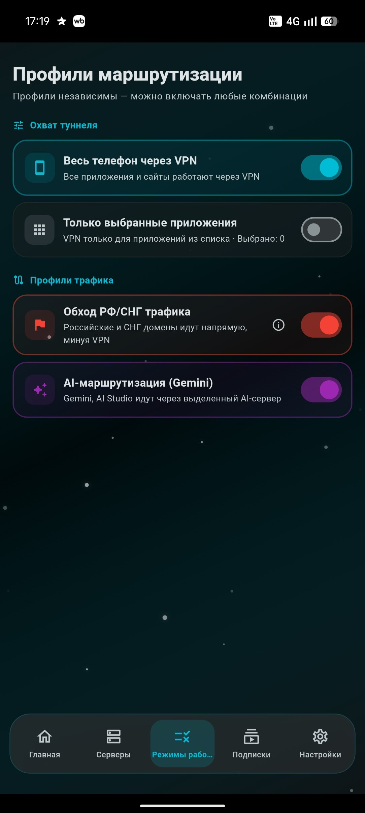

# ❄️ SnowVPN

**Быстрый и безопасный VPN-клиент для Windows и Android** 
**Fast and secure VPN client for Windows and Android**

 

 

[🌐 Сайт / Website](https://snowservice.github.io/snowvpn) &nbsp;·&nbsp; [📥 Скачать / Download](https://github.com/snowservice/snowvpn/releases/latest)

 

---

## 📥 Скачать / Download

| Платформа | Скачать |
|:---------:|:-------:|
| 🖥️ **Windows** | [**Скачать .exe →**](https://github.com/snowservice/snowvpn/releases/latest) |
| 🤖 **Android** | [**Скачать .apk →**](https://github.com/snowservice/snowvpn/releases/latest) |

---

## 📸 Скриншоты / Screenshots

**🖥️ Windows**

  

**🤖 Android**

---

## ✨ Возможности / Features

### 🖥️ Windows
| | RU | EN |
|--|----|----|
| ⚡ | **Быстрое подключение** — один клик и ты в сети | **Fast connection** — one click and you're online |
| 🌍 | **30+ стран** — серверы в Европе, Азии и СНГ | **30+ countries** — servers in Europe, Asia and CIS |
| 🔀 | **VPN по приложениям** — готовые правила, остальные работают напрямую | **Per-app VPN** — preset rules, other apps connect directly |
| ✨ | **AI-маршрутизация** — функция в настройках, позволяет использовать Gemini и AI Studio с любого сервера | **AI routing** — setting that lets you use Gemini and AI Studio from any server |

### 🤖 Android
| | RU | EN |
|--|----|----|
| ⚡ | **Быстрое подключение** — одно нажатие и ты в сети | **Fast connection** — one tap and you're online |
| 🌍 | **30+ стран** — серверы в Европе, Азии и СНГ | **30+ countries** — servers in Europe, Asia and CIS |
| 🔀 | **VPN по приложениям** — выбери какие приложения идут через VPN | **Per-app VPN** — choose which apps go through VPN |
| 🇷🇺 | **Обход РФ трафика** — российские сайты напрямую, иностранные через VPN | **RU bypass** — Russian sites directly, foreign ones through VPN |
| ✨ | **AI-маршрутизация** — 5 нажатий на настройки → выбери сервер Gemini (рекомендуем Турцию) | **AI routing** — tap settings 5 times → choose a Gemini server (Turkey recommended) |

---

**Нравится проект? Поставь звезду! / Like the project? Give it a star! ⭐**

 

❄️ **SnowVPN** — [snowservice.github.io/snowvpn](https://snowservice.github.io/snowvpn)

