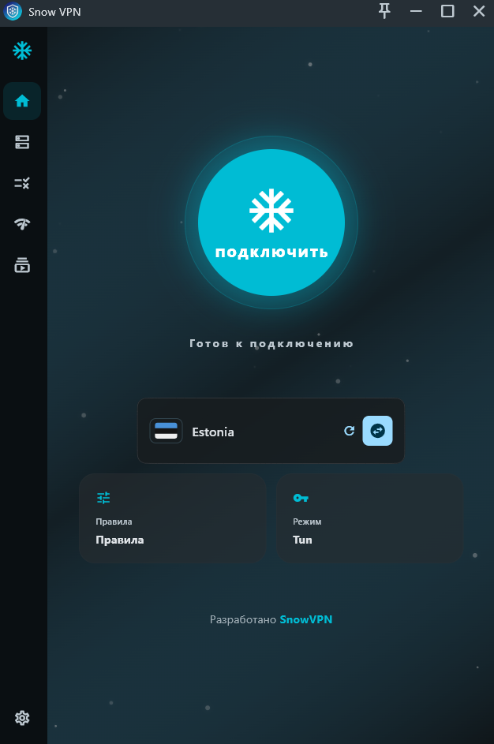
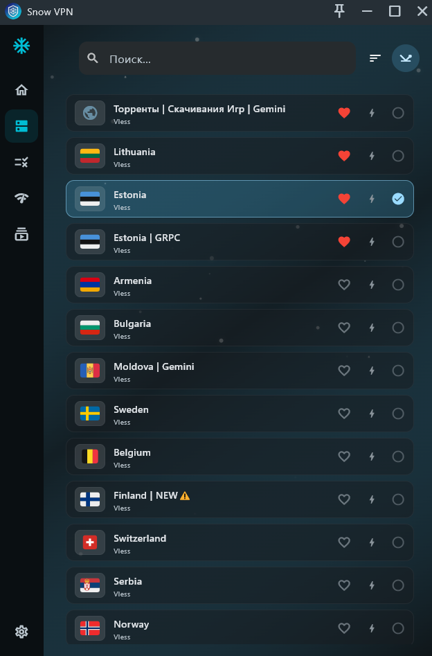
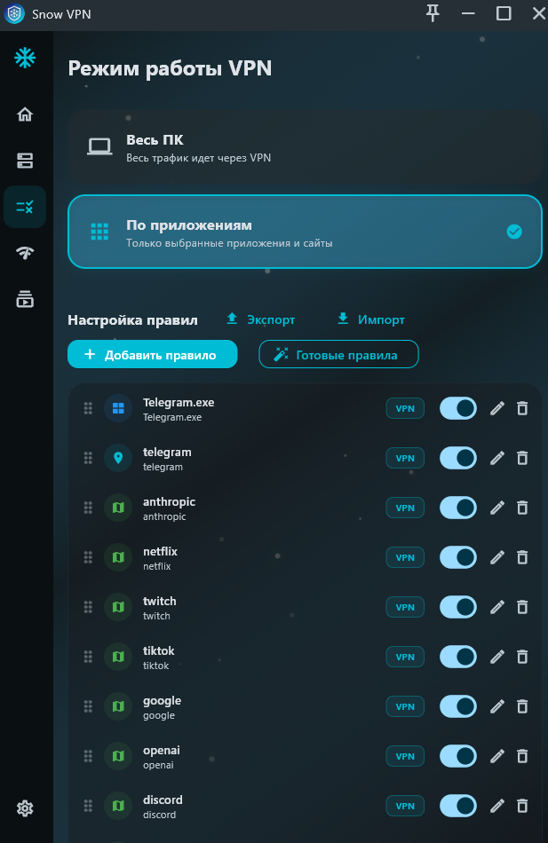
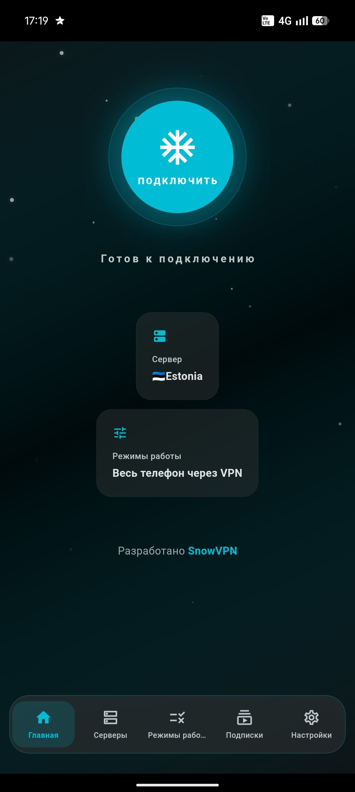
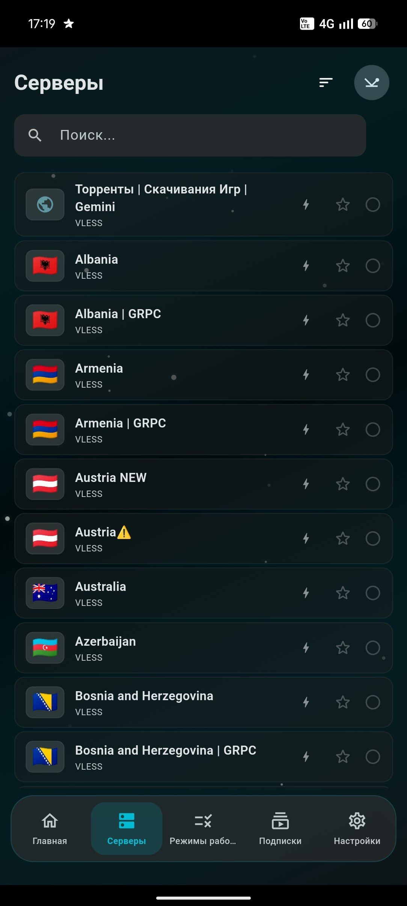
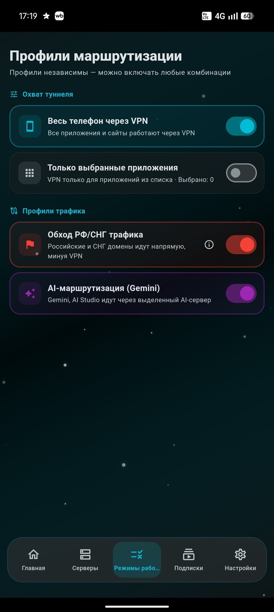

# ❄️ Snow Service

**Быстрый и безопасный VPN для Windows и Android** 
**Fast and secure VPN for Windows and Android**

 

 

[🌐 Сайт / Website](https://snowservice.github.io/snowvpn) &nbsp;·&nbsp; [📥 Скачать / Download](https://github.com/snowservice/snowvpn/releases/latest)

 

---

## 📥 Скачать / Download

| Платформа | Скачать |
|:---------:|:-------:|
| 🖥️ **Windows** | [**Скачать .exe →**](https://github.com/snowservice/snowvpn/releases?q=windows) |
| 🤖 **Android** | [**Скачать .apk →**](https://github.com/snowservice/snowvpn/releases?q=android) |

---

## 🚀 Быстрый старт (Windows) / Quick Start (Windows)

**RU**
1. Скачай и запусти установщик по кнопке выше (либо возьми portable-версию в том же релизе, если не хочешь ставить).
2. Открой вкладку **«Подписки»** и вставь ссылку на подписку (или добавь ключ через бота), нажми **«Добавить и применить»**.
3. На главном экране выбери сервер и нажми **«Подключить»**.
4. Режим по умолчанию — **TUN** (весь трафик через VPN, самый простой и надёжный вариант). Если нужно, чтобы через VPN шли только отдельные приложения — переключись на вкладке **«Правила»** в режим **«По приложениям»** и настрой их там.

**EN**
1. Download and run the installer above (or grab the portable build from the same release if you don't want to install).
2. Open the **«Subscriptions»** tab, paste your subscription link (or add a key via the bot), press **«Add and apply»**.
3. On the home screen pick a server and press **«Connect»**.
4. Default mode is **TUN** (all system traffic goes through VPN — the simplest, most reliable option). If you only want specific apps routed through VPN, switch to **«Per-app»** mode on the **«Rules»** tab and configure them there.

---

## 📸 Скриншоты / Screenshots

**🖥️ Windows**

  

**🤖 Android**

---

## ✨ Возможности / Features

### 🖥️ Windows
| | RU | EN |
|--|----|----|
| ⚡ | **Быстрое подключение** — один клик и ты в сети | **Fast connection** — one click and you're online |
| 🌍 | **30+ стран** — серверы в Европе, Азии и СНГ | **30+ countries** — servers in Europe, Asia and CIS |
| 🔀 | **VPN по приложениям** — готовые правила, остальные работают напрямую | **Per-app VPN** — preset rules, other apps connect directly |
| ✨ | **AI-маршрутизация** — функция в настройках, позволяет использовать Gemini и AI Studio с любого сервера | **AI routing** — setting that lets you use Gemini and AI Studio from any server |

### 🤖 Android
| | RU | EN |
|--|----|----|
| ⚡ | **Быстрое подключение** — одно нажатие и ты в сети | **Fast connection** — one tap and you're online |
| 🌍 | **30+ стран** — серверы в Европе, Азии и СНГ | **30+ countries** — servers in Europe, Asia and CIS |
| 🔀 | **VPN по приложениям** — выбери какие приложения идут через VPN | **Per-app VPN** — choose which apps go through VPN |
| 🇷🇺 | **Обход РФ трафика** — российские сайты напрямую, иностранные через VPN | **RU bypass** — Russian sites directly, foreign ones through VPN |
| ✨ | **AI-маршрутизация** — 5 нажатий на настройки → выбери сервер Gemini (рекомендуем Турцию) | **AI routing** — tap settings 5 times → choose a Gemini server (Turkey recommended) |

---

## 🆘 Проблемы? / Having issues?

Не открывается / не подключается — попробуй встроенный режим щадящей диагностики или напиши в поддержку через приложение (Настройки → Поддержка). Подробный гайд с картинками — на [сайте](https://snowservice.github.io/snowvpn).

Something not working? Try the app's built-in diagnostics or reach support from the app (Settings → Support). A detailed step-by-step guide with screenshots is on the [website](https://snowservice.github.io/snowvpn).

---

**Нравится проект? Поставь звезду! / Like the project? Give it a star! ⭐**

 

❄️ **Snow Service** — [snowservice.github.io/snowvpn](https://snowservice.github.io/snowvpn)

